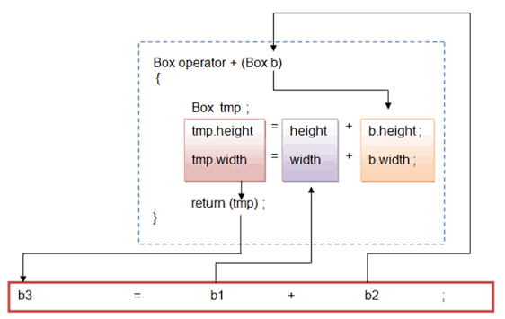

 #OOP Object-Oriented Programming (OOP) is a programming paradigm that organizes programs around classes and objects. A class defines the data members and member functions, while an object is an instance of a class. OOP helps build modular, reusable, and maintainable software by modeling real-world entities.

Promotes code reusability through inheritance. Improves code maintainability and scalability. Provides data security through encapsulation. Models real-world entities using classes and objects.

==============================

 
 `- Constructors
A constructor is a special method that is automatically called when an object of a class is created.
To create a constructor, use the same name as the class, followed by parentheses ():
 ........
     Constructor Rules
The constructor has the same name as the class.
It has no return type (not even void).
It is usually declared public.
It is automatically called when an object is created.

2 - functions overloading 
   more than one function with the same name but the diffrent is in the signutre
   - number of the parameters 
   - diffrentiation in the data types of the parameters 
   - arrangement of the parameters 
 Why Use Constructor Overloading?
To give flexibility when creating objects
To set default or custom values
To reduce repetitive code
#####################

======================================  

Access Specifiers or access modifier
Access specifiers control how the members (attributes and methods) of a class can be accessed.

They help protect data and organize code so that only the right parts can be seen or changed

public - members are accessible from outside the class
private - members cannot be accessed (or viewed) from outside the class
protected - members cannot be accessed from outside the class, however, they can be accessed in inherited classes

 default copy constractor 
 - another way to intialize an object : 
 - initialze obj with another obj off the same type
 - no need to create spcial constractor of this; one is already built into classes 

 passing objs as an Arguments .

 static class member 
 - Static data members are class members declared using the static keyword. 
 Unlike non-static members, a static data member belongs to the class itself, not to individual objects
  
  - A static dta items is usful when all objs of the same class must share a comman information .
  - its lifetime is entire program . It continues to exist even if there are no objs of the classs
  - to invoke a static method or static filed , use the class name , rather than the instance name .

  Static Methods are convenient () because they may be called at the class level.
   they are tipically used to create utility classes .
   Static methods may not communicate with instance fileds , only static filed .  
     == (static method can be called without creating an object of the class).
# :: ==> Scope operator .

// what is Inheretance ?
 
Inheritance allows one class to reuse attributes and methods from another class. It helps you write cleaner, more efficient code by avoiding duplication.

We group the "inheritance concept" into two categories:

derived class (child) - the class that inherits from another class
base class (parent) - the class being inherited from
To inherit from a class, use the : symbol.

In the example below, the Car class (child) inherits the attributes and methods from the Vehicle class (parent):

 