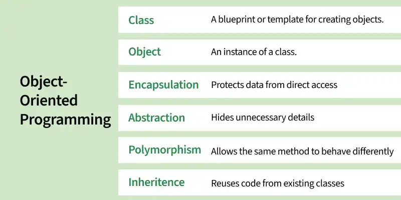
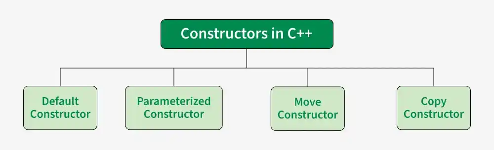
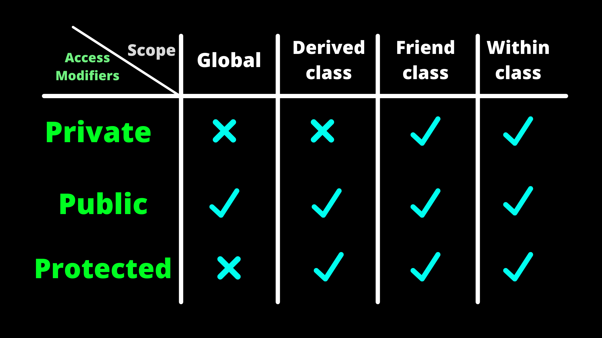

 #OOP Object-Oriented Programming (OOP) is a programming paradigm that organizes programs around classes and objects. A class defines the data members and member functions, while an object is an instance of a class. OOP helps build modular, reusable, and maintainable software by modeling real-world entities.

Promotes code reusability through inheritance. Improves code maintainability and scalability. Provides data security through encapsulation. Models real-world entities using classes and objects.

==============================

 
 `- Constructors
A constructor is a special method that is automatically called when an object of a class is created.
To create a constructor, use the same name as the class, followed by parentheses ():
 ........
     Constructor Rules
The constructor has the same name as the class.
It has no return type (not even void).
It is usually declared public.
It is automatically called when an object is created.

2 - functions overloading 
   more than one function with the same name but the diffrent is in the signutre
   - number of the parameters 
   - diffrentiation in the data types of the parameters 
   - arrangement of the parameters 
 Why Use Constructor Overloading?
To give flexibility when creating objects
To set default or custom values
To reduce repetitive code
#####################

======================================  

Access Specifiers or access modifier
Access specifiers control how the members (attributes and methods) of a class can be accessed.

They help protect data and organize code so that only the right parts can be seen or changed

public - members are accessible from outside the class
private - members cannot be accessed (or viewed) from outside the class
protected - members cannot be accessed from outside the class, however, they can be accessed in inherited classes

 default copy constractor 
 - another way to intialize an object : 
 - initialze obj with another obj off the same type
 - no need to create spcial constractor of this; one is already built into classes 

 passing objs as an Arguments .
  
 